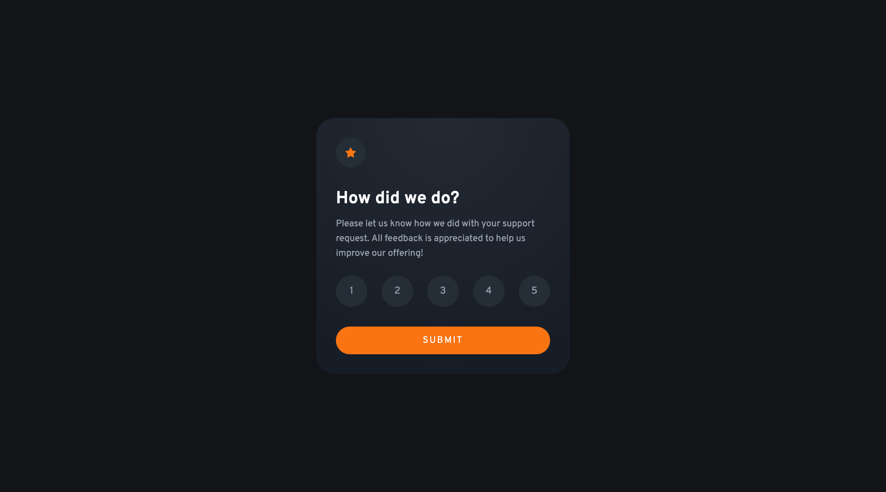

# Frontend Mentor - Interactive rating component solution

This is a solution to the [Interactive rating component challenge on Frontend Mentor](https://www.frontendmentor.io/challenges/interactive-rating-component-koxpeBUmI). Frontend Mentor challenges help you improve your coding skills by building realistic projects. 

## Table of contents

- [Overview](#overview)
  - [The challenge](#the-challenge)
  - [Screenshot](#screenshot)
  - [Links](#links)
- [My process](#my-process)
  - [Built with](#built-with)
  - [What I learned](#what-i-learned)
- [Author](#author)
- [Acknowledgments](#acknowledgments)

## Overview

### The challenge

Users should be able to:

- View the optimal layout for the app depending on their device's screen size
- See hover states for all interactive elements on the page
- Select and submit a number rating
- See the "Thank you" card state after submitting a rating

### Screenshot



### Links

- Solution URL: [Github](https://github.com/kwonmoon/interactive-rating-component-main)
- Live Site URL: [Netlify](https://magnificent-brigadeiros-15473e.netlify.app/)

## My process

### Built with

- Semantic HTML5 markup
- CSS custom properties
- Flexbox
- Javascript

### What I learned

Display either rating component screen or thankyou screen using javascript.
To see how you can add code snippets, see below:

```js
submit_button.addEventListener("click", () => {
   card.style.display = "none";
   thankyou.style.display = "flex";
   document.querySelector("#point").innerHTML = localStorage.getItem("score");
});
```

### Useful resources

## Author

- Frontend Mentor - [@kwonmoon](https://www.frontendmentor.io/profile/kwonmoon)

## Acknowledgments

chatGPT